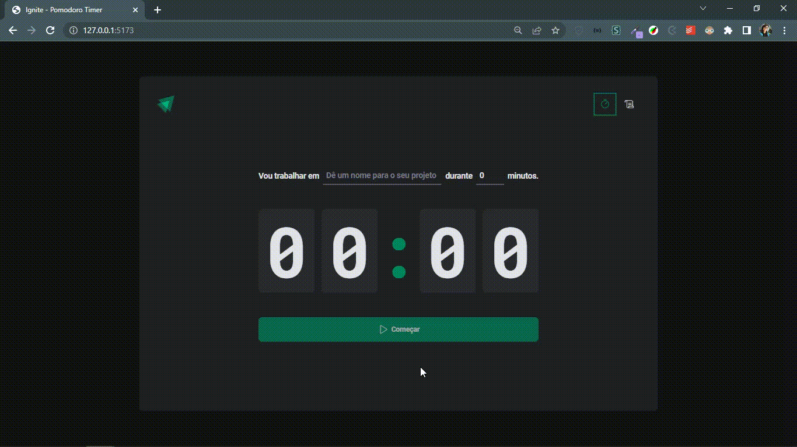

<h1 align="center">Ignite 2022 - Projeto Pomodoro</h1>

<blockquote align="center">“A chave para transformação é a continuidade. Continue a codar!!!”</blockquote>

 

 

 
 

## Sumário

- [Apresentação](#apresentação)
- [Sobre o Projeto](#sobre-o-projeto)
- [Tecnologias utilizadas](#tecnologias-utilizadas)

 

# Apresentação

 

  

 

## Sobre o Projeto

 

Essa aplicação tem como objetivo desenvolver um timer de Pomodoro para marcar o tempo de desenvolvimento de projetos.

O que foi visto neste projeto:

* Estilização com Styled-Components;
* Roteamento com React Router DOM;
* Context do React;
* Reducers um formato para trabalhar com dados complexos e realizar ações em cima de listas complexas de dados, um único local para armazenar e gerir essas informações;
* Immer uma forma de trabalhar com a imutabilidade no React;
* React Hook Form e a validação utilizando Hook Form Resolvers.

 

## Tecnologias Utilizadas

 

<code></code>
<code></code>
<code></code>

 
 

 
 

<h3 align="center">
    
</h3>
