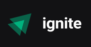

# Ignite - Trilha ReactJS 2022 - Rocketseat 🚀
 
<h3 align="center">
    
</h3>
 

 

<blockquote align="center">“A chave para transformação é a continuidade. Continue a codar!!!”</blockquote>

 

 
 

## Sumário

- [Sobre o Ignite](#sobre-o-ignite)
- [Projetos](#projetos)

 

## Sobre o Ignite

 

O Ignite é um treinamento para desenvolvedores que já possuem um conhecimento em programação e é divido em três trilhas: ReactJS (a qual corresponde a este repositório), React Native e NodeJS.

O objetivo deste treinamento é desenvolver habilidades com atividades mão na massa conhecendo e utilizando tecnologias da atualidade e que são requisitadas no mercado de trabalho.

 

## Projetos

Encontram-se a seguir os projetos que são realizados durante o Ignite.

- [x] [Iniciando com React](01-fundamentos-reactjs)

<!-- - [x] [Gym Manager](gymManager)

- [x] [codeSCool](codeSCool)

- [x] [Starting on Frontend](iniciando_no_frontend)

- [x] [Starting on Backend](iniciando_no_backend)

- [x] [Starting with Javascript](iniciando_no_javascript) -->

