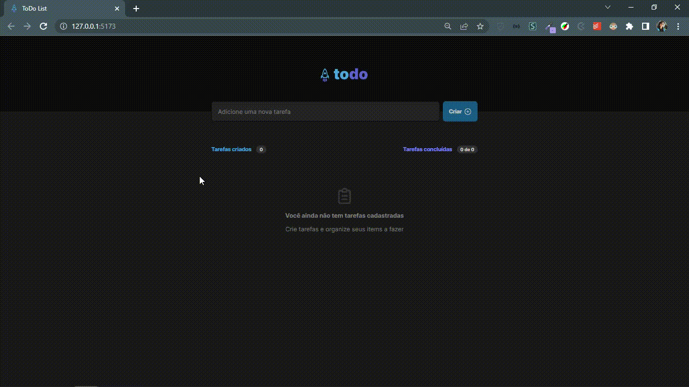

<h1 align="center">Ignite 2022 - Desafio: Todo List</h1>

<blockquote align="center">“A chave para transformação é a continuidade. Continue a codar!!!”</blockquote>

 

 

 
 

## Sumário

- [Apresentação](#apresentação)
- [Sobre o Projeto](#sobre-o-projeto)
- [Tecnologias utilizadas](#tecnologias-utilizadas)

 

# Apresentação

 

  

 

## Sobre o Projeto

 

Esse desafio faz parte da nova trilha do Ignite (2022) e tem como objetivo reforçar os conceitos de ReactJS que foram abordados nas aulas.

Para essa aplicação foram desenvolvidas as seguintes funcionalidades:

  * Adicionar uma nova tarefa;
  * Marcar e desmarcar uma tarefa como concluída;
  * Remover uma tarefa da listagem;
  * Mostrar o progresso de conclusão das tarefas;

Conceitos utilizados:

* Estados;
* Imutabilidade do estado;
* Listas e chaves no ReactJS;
* Propriedades;
* Componentização;

Métodos de manipulação de arrays:

* map, filter e reduce;

 

## Tecnologias Utilizadas

 

<code></code>
<code></code>

 
 

 
 

<h3 align="center">
    
</h3>
